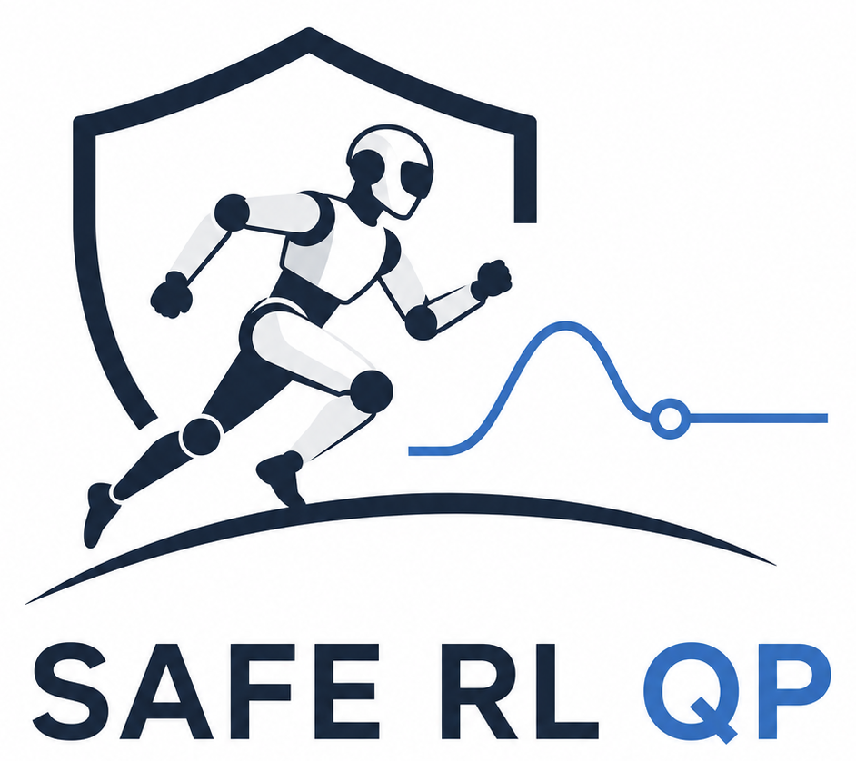

<p align="center">
  
</p>

# 🛡️ mc_nn_SafeCBFTorquePolicyContract

**Torque-level RL control with an acceleration-based CBF-QP for mc_rtc.**

This external [mc_nn] contract builds policy observations, maps actions to
joint targets, computes PD torque targets, and optionally routes them through
a Control Barrier Function Quadratic Program (CBF-QP). mc_nn provides model
discovery, scheduling, shared policy lifecycle, common GUI controls and logs.

> **Looking for shared mc_nn behavior?** This README focuses on this contract's
> torque-control pipeline, policy files and host requirements. The overall
> policy lifecycle, RunNN configuration and FSM completion behavior are
> documented in the [main mc_nn README](https://github.com/isri-aist/mc_nn/blob/main/README.md)
> and the [mc_nn contracts guide](https://github.com/isri-aist/mc_nn/blob/main/contracts/README.md).
> Start there if a shared behavior or option is not explained here.

> **Safety:** `use_QP: false` applies torques directly after the QP solve and
> bypasses the CBF-QP constraints. Use the bypass only when appropriate for
> your application and with suitable safeguards.

## Contents

- [What this contract does](#what-this-contract-does)
- [Requirements](#requirements)
- [Build and install](#build-and-install)
- [Configure RunNN](#configure-runnn)
- [Contract-specific options](#contract-specific-options)
- [Policy files](#policy-files)
- [Deploy a policy](#deploy-a-policy)
- [Host configuration](#host-configuration)
- [Hooks used](#hooks-used)
- [Runtime and cleanup](#runtime-and-cleanup)
- [Control flow](#control-flow)
- [Robot-specific adaptation](#robot-specific-adaptation)

Already familiar with the RL-QP implementation? Jump to
[Build and install](#build-and-install), [Configure RunNN](#configure-runnn),
or the upstream [RL-QP documentation](https://alhuuin.github.io/rl-qp-controller.github.io/).

## What this contract does

The CBF-QP enforces configured constraints, including:

* Joint position limits
* Joint velocity limits
* Torque limits
* Self-collision avoidance

The contract currently supports ONNX policies. Its approach is described in
[*Safe Execution of RL Policies via Acceleration-based CBF-QP Constraint Enforcement for Real-World Robotic Deployments*](https://hal.science/hal-05362571).

Robot-specific RL-QP implementations are available for [H1](https://github.com/Alhuuin/h1_rl_qp_controller)
and [HRP5P](https://github.com/bastien-muraccioli/hrp5p_rl_qp_controller).
If your robot is not supported by those projects, use this contract as a
starting point for integration.

### RL-QP and robot-adaptation documentation

The [RL-QP documentation](https://alhuuin.github.io/rl-qp-controller.github.io/)
covers the architecture, observations, policy configuration and robot
adaptation. This README focuses on building and deploying it through mc_nn.

## Requirements

- Build mc_rtc/TVM with `mc_tasks::TorqueJointTask`, the CBF `DynamicsConstraint`
  (5-parameter damper), and `CollisionsConstraint::setCollisionsDampers`.
  Otherwise CMake skips this optional contract and reports why.
- Build and install [mc_nn].
- Optional: `mc_joystick_plugin` enables joystick commands. Keyboard and GUI
  commands remain available without it.
- The host must support mc_nn's `"MCNN::AfterSolve"` callback. This is required
  by the contract even when using the QP; `use_QP: false` uses it to apply
  torques after the solver. The supplied `MCNN` controller provides the
  callback; other hosts must implement it (see the
  [mc_nn host requirements](https://github.com/isri-aist/mc_nn/blob/main/contracts/README.md#host-controller-requirements)).
- Use `FeedbackType: ClosedLoopIntegrateReal` for the intended feedback
  behavior; another value produces a warning.
- Do not declare a host `dynamics` constraint in the FSM configuration. The
  contract installs its CBF dynamics constraint while running and restores the
  previous one during teardown. Keep host `collisions` and observer-pipeline
  configuration (see [Host configuration](#host-configuration) and the
  [mc_nn host-controller requirements](https://github.com/isri-aist/mc_nn/blob/main/contracts/README.md#host-controller-requirements)).

## Build and install

Build and install mc_nn first, then build this external contract against that
installation:

```bash
cmake -S . -B build \
  -DCMAKE_BUILD_TYPE=RelWithDebInfo \
  -Dmc_nn_DIR=<mc_nn-prefix>/lib/cmake/mc_nn
cmake --build build --parallel
cmake --install build
```

`mc_nn_DIR` can be omitted if mc_nn is installed in a default CMake prefix; in
the mcrtc workspace layout, the package also looks for `../mc_nn/install`.
To install the contract outside the mc_rtc prefix, configure
`-DMC_RTC_HONOR_INSTALL_PREFIX=ON -DCMAKE_INSTALL_PREFIX=<contract-prefix>`.

CMake reports whether the contract was enabled for the available mc_rtc build.
The library is installed under `<mc_rtc libdir>/mc_nn_contracts` (commonly
`<prefix>/lib/mc_nn_contracts`); add its actual install directory to
`contracts_dirs`. Example policies are installed under
`<contract-prefix>/share/mc_nn_SafeCBFTorquePolicyContract/policies`.
Installing this external contract does not require rebuilding mc_nn: point
RunNN's `contracts_dirs` at the directory containing the installed library.
For the general external-contract build and deployment workflow, see
[External contracts](https://github.com/isri-aist/mc_nn/blob/main/contracts/README.md#external-contracts).
The example `.onnx` files are empty placeholders: replace them with exported
models before use. Rebuild this contract when mc_nn changes.

## Configure RunNN

This example keeps the shared RunNN settings visible and shows where the
contract-specific options belong. The full shared configuration, types,
defaults, model discovery and FSM transition behavior are in the
[mc_nn RunNN configuration guide](https://github.com/isri-aist/mc_nn/blob/main/README.md#runnn-configuration).
The relevant details for this example are
[model discovery and policy IDs](https://github.com/isri-aist/mc_nn/blob/main/README.md#model-discovery-and-policy-ids),
[GUI and runtime controls](https://github.com/isri-aist/mc_nn/blob/main/README.md#gui-and-runtime-controls),
[exclusivity and multiple policies](https://github.com/isri-aist/mc_nn/blob/main/README.md#exclusivity-and-multiple-policies),
and [completion and FSM transitions](https://github.com/isri-aist/mc_nn/blob/main/README.md#completion-and-fsm-transitions).

```yaml
states:
  RLQPPolicies:
    base: RunNNBase
    # Use the installed examples or replace with your own model folders.
    models_dirs: ["<contract-prefix>/share/mc_nn_SafeCBFTorquePolicyContract/policies"]
    # Directory containing this external contract's shared library.
    contracts_dirs: ["<mc_rtc libdir>/mc_nn_contracts"]
    preload: false
    verbose: 1
    gui: true
    logs: true
    active_policies: [minimalExample]
    policies:
      - onnx: ["minimalExample", "fullExample"]
        prefix: ""
        contract: mc_nn_SafeCBFTorquePolicyContract
        # Shared RunNN options; see the mc_nn configuration guide for details.
        policy_hz: 0
        timeout: 0.0
        blocking: true
        exclusive: true
        device: auto
        # Contract-specific RunNN options:
        robot:
          base_body: base_link
          observation_source: realRobot
        # Empty auto-resolves <policy-folder>/../conventions.yaml.
        conventions_file: ""
```

`active_policies` starts the selected policy IDs when the state begins. Remove
`fullExample` from the `onnx` selector if you do not want it configured for this
state; use `active_policies` to choose what starts automatically.

### Contract-specific options

| Setting | Type | Default | Purpose |
| --- | --- | --- | --- |
| `robot.base_body` | string | `base_link` | Body used by floating-base observations. |
| `robot.observation_source` | string | `realRobot` | Robot state source: `realRobot` for measured/estimated state or `robot` for the controller model. |
| `conventions_file` | string | `<policy-folder>/../conventions.yaml` | Overrides the conventions file used for joint groups, aliases and observation defaults. |

The default conventions path is resolved relative to the selected model folder:
`<policy-folder>/../conventions.yaml`. `robot.observation_source` accepts only
`realRobot` or `robot`. For the separation between shared RunNN settings and
contract-specific fields, see
[contract responsibilities](https://github.com/isri-aist/mc_nn/blob/main/contracts/README.md#responsibilities-and-examples).

## Policy files

Each policy is a directory containing `policy.yaml`, `observations.yaml`, and
the ONNX model selected by RunNN. The model filename (without `.onnx`) plus
`prefix` forms the RunNN policy ID. `policy.yaml`'s `onnx` field is ignored by
mc_nn; its optional `name` is used as the contract GUI display name.

| File / setting | Type | Default or requirement | Purpose |
| --- | --- | --- | --- |
| `action.joints` | string | Required | Named group in `conventions.yaml` defining the ONNX action order. |
| `action.controlled_joints` | string | `action.joints` | Optional named group limiting which action joints are controlled. |
| `action.scale` | number or map | `1.0` | Scalar or per-joint scale applied to model actions. |
| `action.q0` | map | Optional | Per-joint reference pose in radians; if provided, include every controller joint. |
| `control.kp`, `control.kd` | maps | Required for every controller joint | Per-joint PD gains; keep consistent with training and robot tuning. |
| `control.use_QP` | boolean | `true` | Route torque targets through the CBF-QP; `false` bypasses it. |
| `control.period_s` or `control.frequency_hz` | number | `0.02 s` / `50 Hz` | Policy inference period; specify at most one. RunNN `policy_hz: 0` uses this rate. |
| `control.pd_gains_ratio` | number | `1.0` | Scales runtime gains: `Kp = ratio * kp`, `Kd = sqrt(ratio) * kd`. |
| `control.phase_period` | number | `1.0 s` | Period used by phase observations. |

The policy loader also accepts command-velocity settings under
`control.vel_cmd_speed` (`xy` and `yaw`, each defaulting to `0.4`). See the
[minimal policy example](policies/minimalExample/policy.yaml) for the smallest
configuration and the [full policy example](policies/fullExample/policy.yaml)
for an expanded configuration reference. `observations.yaml`
configures observation order, history and parameters; `conventions.yaml` holds
training joint groups, aliases and observation defaults. Use
[`scripts/inspect_policy.py`](scripts/inspect_policy.py) to inspect model
inputs and outputs. For shared model-file and tensor constraints, see
[ONNX model requirements](https://github.com/isri-aist/mc_nn/blob/main/contracts/README.md#onnx-model-requirements).

## Deploy a policy

1. Create a policy folder under any directory in `models_dirs`.
2. Add the exported ONNX model and a matching `policy.yaml`.
3. Configure action and controlled-joint groups, training-consistent `kp` and
   `kd`, action scaling, reference pose and any command/phase settings.
4. Reproduce the model's exact observation feature order and history in
   `observations.yaml`.
5. Make the required `conventions.yaml` available beside the policy folders or
   set `conventions_file` in the RunNN policy entry.

The model must be compatible with the robot's action and observation sizes.
These files are robot/training specific; use the linked RL-QP documentation
and the included examples as references rather than assuming the placeholder
values work on a real robot. RunNN's search paths, wildcard matching and policy
IDs are described under
[Model discovery and policy IDs](https://github.com/isri-aist/mc_nn/blob/main/README.md#model-discovery-and-policy-ids).

## Host configuration

Configure solver feedback, environment robots, collision handling and
observers in the host controller's robot configuration, for example
`~/.config/mc_rtc/controllers/MCNN/<robot>.yaml`. Adapt this example to the
robot and application. The callback and host integration requirements are
summarized in the [mc_nn contracts guide](https://github.com/isri-aist/mc_nn/blob/main/contracts/README.md#host-controller-requirements):

```yaml
FeedbackType: ClosedLoopIntegrateReal
robots:
  ground:
    module: env/ground
collisions:
  - type: collision
    useMinimal: true
# Constraint examples. Keep only constraints supported by your robot and application.
# Do not add a `dynamics` constraint: the contract installs the CBF one.
# constraints:
#   - type: contact
#     contactType: acceleration
#   - type: compoundJoint

# TODO(robot): adjust the ObserverPipeline
ObserverPipelines:
  name: MainPipeline
  gui: true
  log: true
  observers:
    - type: Encoder
      config:
        velocity: encoderVelocities
```

## Hooks used

This contract derives directly from `MCNNContract` because it owns a custom
runtime and manages its ONNX model, torque task and QP integration rather than
using the single-model `MCNN` input/action pipeline.
For the distinction between `MCNN` and `MCNNContract`, and the complete hook
contracts/defaults, see the
[mc_nn hooks reference](https://github.com/isri-aist/mc_nn/blob/main/contracts/README.md#hooks-reference).

| Hook | How this contract uses it |
| --- | --- |
| `configure` | Reads `robot` and `conventions_file`, then gets the default inference rate from the policy's `control.period_s` or `control.frequency_hz`. |
| `load` / `loaded` | Creates and reports the ONNX Runtime-backed `MCNNModel`. |
| `defaultRateHz` | Uses the inference rate from `policy.yaml` when RunNN `policy_hz` is `0`. |
| `defaultExclusive` | Returns `true`, since the contract drives the robot's actuated joints in torque. |
| `requiresAfterSolve` | Returns `true`; the host must support the `MCNN::AfterSolve` callback. |
| `start` | Installs the CBF dynamics constraint and torque task, temporarily removes the host posture task, loads policy configuration and resets runtime state. |
| `update` | Handles joystick/keyboard commands, optional limit checks and phase updates, and refreshes the held posture target each controller tick. |
| `step` | Runs observation construction and ONNX inference at the configured policy rate, then updates the torque-task target. |
| `afterSolve` | Applies policy torques directly after the QP when `use_QP: false`. |
| `teardown` | Removes the torque task and restores the host posture task, dynamics constraint and `ControlMode` when applicable. |
| `addGui` | Adds policy/convention details, PD-gain and QP controls, limit-print toggle, and velocity-command controls. |
| `addLog` | Adds contract-specific gain, action, phase, command, QP and observation entries under RunNN's policy log prefix. |

Common model selection, scheduling, pause/play/reload, GUI and logs are handled
by RunNN; see the [mc_nn contracts guide](https://github.com/isri-aist/mc_nn/blob/main/contracts/README.md)
for the complete hook lifecycle and API.

## Runtime and cleanup

Use RunNN's Ready policies dropdown and Launch, Pause/Play, Remove and Reload
controls to manage policies. Common status and rates appear in the mc_nn GUI;
contract-specific controls are under
`MCNN / <state> / <policy id> / mc_nn_SafeCBFTorquePolicyContract`. Logs use
`MCNN_<policy id>_*` prefixes; mc_nn supplies common observations, actions and
rates, while this contract adds RL-QP-specific values. For the shared policy
states and control semantics, see
[GUI and runtime controls](https://github.com/isri-aist/mc_nn/blob/main/README.md#gui-and-runtime-controls);
for inference scheduling, preload and execution-provider considerations, see
[Runtime and performance](https://github.com/isri-aist/mc_nn/blob/main/README.md#runtime-and-performance).

When the contract stops (pause, remove or end of state), it removes its torque
task and restores the host posture task, dynamics constraint and `ControlMode`.
The self-collision dampers retain the values set by the contract because mc_rtc
does not provide a getter to restore previous values. For the general pause,
remove, reload and teardown sequence, see the
[contract lifecycle](https://github.com/isri-aist/mc_nn/blob/main/contracts/README.md#lifecycle).

## Control flow

```
Every controller timestep (physics_step_size):
├── update(): commands, optional limit checks, phase and held target q_rl
├── when the policy period elapses, step():
│   ├── build observations
│   ├── run ONNX inference
│   └── q_rl = action * actionScale + q_zero
│
├── τ = Kp*(q_rl - q) - Kd*q̇
│
├── useQP=true:  τ → TorqueJointTask → CBF-QP → robot
└── useQP=false: τ → robot (direct, afterSolve())
```

RunNN's surrounding tick, inference-rate scheduling and FSM completion behavior
are described in [RunNN configuration](https://github.com/isri-aist/mc_nn/blob/main/README.md#runnn-configuration)
and [Completion and FSM transitions](https://github.com/isri-aist/mc_nn/blob/main/README.md#completion-and-fsm-transitions).

## Robot-specific adaptation

The source marks robot-dependent locations with `TODO(robot)`. Review them
before running on a new robot:

```bash
grep -rn "TODO(robot)" .
```

This includes base-body and joint conventions, supported constraints, task
weights/stiffness, observations and command limits. The included example
ONNX files are placeholders, not trained policies. For guidance on adding a
contract and validating/cleaning up resources, see
[Add a contract](https://github.com/isri-aist/mc_nn/blob/main/contracts/README.md#add-a-contract)
and [Contract guidelines](https://github.com/isri-aist/mc_nn/blob/main/contracts/README.md#contract-guidelines).

[mc_rtc]: https://jrl-umi3218.github.io/mc_rtc/
[mc_nn]: https://github.com/isri-aist/mc_nn
